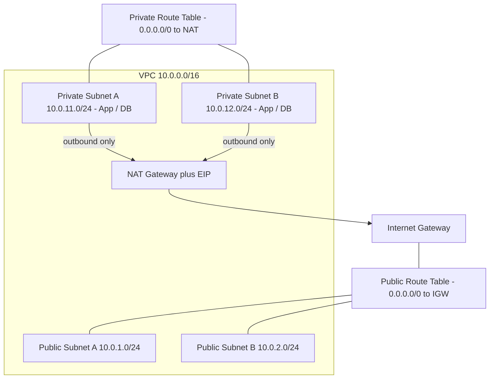

# Architecture — Secure Multi-Tier VPC

Secure network foundation with public and private subnets across two Availability Zones.

## How it works

- Public subnets host internet-facing resources and route to the Internet Gateway.
- Private subnets host the application and database tiers with no direct inbound internet access.
- The NAT Gateway allows private instances outbound internet access only (for updates).
- Network ACLs provide stateless subnet-level filtering and Security Groups provide stateful instance-level filtering.
