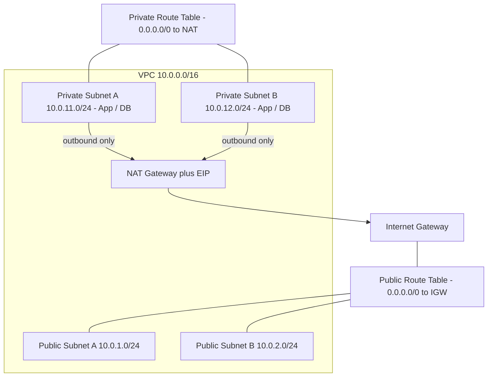

# Secure Multi-Tier VPC Architecture on AWS

> Public & Private Subnets · Route Tables · Internet Gateway · NAT Gateway · NACLs · Security Groups

A reference design for a **secure, multi-tier network** on AWS. Public-facing
resources (load balancers / bastion) live in public subnets, while application
and database tiers live in private subnets with **no direct internet access**.
Outbound internet for private instances is provided through a NAT Gateway.

---

## Skills Demonstrated
- **VPC** design and CIDR planning
- **Public & Private Subnets** across multiple Availability Zones
- **Route Tables** (public route via IGW, private route via NAT)
- **Internet Gateway (IGW)** for public inbound/outbound
- **NAT Gateway** for private-subnet outbound only
- **Network ACLs (NACLs)** — stateless subnet-level firewall
- **Security Groups** — stateful instance-level firewall

---

## Architecture



> Full diagram details: [ARCHITECTURE.md](ARCHITECTURE.md)

---

## Security Layers
| Layer | Type | Scope | Behavior |
|-------|------|-------|----------|
| NACL  | Stateless | Subnet | Explicit allow/deny in & out |
| Security Group | Stateful | Instance/ENI | Return traffic auto-allowed |

**Best practice:** NACLs act as a coarse subnet guardrail; Security Groups do the
fine-grained, per-tier access control (e.g. App tier -> DB tier on 3306 only).

---

## Repository Structure
```
.
├── cloudformation/
│   └── vpc.yaml          # VPC, subnets, IGW, NAT, route tables, NACLs, SGs
├── docs/
│   └── network-plan.md   # CIDR allocation & routing reference
└── README.md
```

---

## Deploy
```bash
aws cloudformation create-stack \\
  --stack-name secure-vpc \\
  --template-body file://cloudformation/vpc.yaml
```

## Cleanup
```bash
aws cloudformation delete-stack --stack-name secure-vpc
```

---

## Author
**Dipak Kuthe** — DevOps / Cloud Engineer
